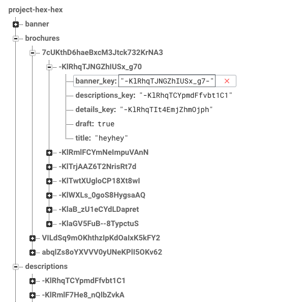

#Bro-sure

Bro-sure allows real estate agents to quickly generate a digital brochure that they can share with clients. This idea originated from personal experience with the real estate resale and rental markets. Although new builds have well-put together brochures and websites with all relevant information for potential buyers to browse, such documents tend not be available for resale and rental properties.

The downside to this is that potential buyers need to ask these questions to real estate agents and store/organise them on their own initiative. With a dedicated digital brochure, this information is at the buyers' fingertips.

This is a full-stack [react application](https://github.com/facebookincubator/create-react-app) with a [node.js](https://nodejs.org/en/) backend, [firebase](https://firebase.google.com/) as a databse and [Semantic UI React](https://react.semantic-ui.com) as the front-end framework.

##Live Demo
This application is deployed on Heroku.
[##Bro-sure](https://blooming-ridge-43510.herokuapp.com/)

##Getting Started

Please note that there are two gitub repositories for this project and both are required for the application to run properly. This is the front-end repository. The back-end repository is [here](https://github.com/dorkblue/wdi-project-4-backend-hexhex).

- Fork and clone this repository.
- Install dependencies `$ npm install` or `$ yarn`
- Start local server `$ npm start` or `$ yarn start`
Once your server is running, visit `http://localhost:3000` on your browser.

##Why React?
Most of the functionality of the application will be on one web page - the digital brochure.

The application that we have chosen to create has a number of user interactions. User are able to:
- Copy and share the unique link of the digital brochure
- Browse picutres through a carousel
- View the amenities surrounding the property through a Google Maps integration. They can check on each amenity to view more information of a particular school or supermarket for example.

From the real estate agent's point of view, the edit mode of the digital brochure is also on a single page and contains even more user interaction, with the ability to upload photos and edit information.

Being able to interact with components in React without constant re-rendering was a big plus. The lack of hierarchy in the structure of our application also made it easier to use React.

##Wireframe
It was important for the digital brochure to be on one page, thus the following wireframe was drafted.

##Splitting Front-end and Back-end
Bro-sure uses two repositories. The front-end repository holds all the react components, including states, CSS and HTML code. The [back-end repository](https://github.com/dorkblue/wdi-project-4-backend-hexhex) holds all the controllers and routers for components which require data or images to be stored. The firebase configuration file is also held in the [back-end repository](https://github.com/dorkblue/wdi-project-4-backend-hexhex).

The is not necessary in the current form of the react application. However, the splitting of front-end and back-end repositories enable us to create a react-native (mobile) version of this application, using the same [back-end repository](https://github.com/dorkblue/wdi-project-4-backend-hexhex), should we choose to.

##Database with Firebase
Firebase, with its minimal setup and integrated cloud hosting was the database of choice for this application. The data structure is as follows:

Each component which requires storage has their own folder, such as banner, descriptions, details etc. Further more, we a folder for users to store authentication details. We also have a folder for brochure which contains a folder for each user and then in the folder, a unique brochure folder for each brochure created by the user. In this brochure folder, we hold the foreign keys for components such as banner, descriptions and details.

##Further Development Work
- Being able to save to PDF
- More functionality for agents to take advantage of, such as rendering of price trend information
- Better use of Google Map api

##Creators
This application is created by [Shue Ze] (https://github.com/dorkblue) and [Maria] (https://github.com/hexhex23).

##Acknowledgments

The following were used in this application:
- [React](https://github.com/facebookincubator/create-react-app)
- [Node.js](https://nodejs.org/en/)
- [Firebase](https://firebase.google.com/)
- [Semantic UI React](https://react.semantic-ui.com)
- [React Slick](https://github.com/akiran/react-slick)
- [Google Maps] (https://developers.google.com/maps/)

& A ##HUGE thank you to our General Assembly Singapore WDI#9 family. Especially,
- [Prima] (https://github.com/primaulia)
- [Yisheng] (https://github.com/yisheng90)
- [Sharona] (https://github.com/sharona1610)

This application was created as the final project for General Assembly's web development course.
